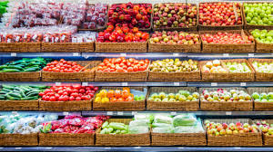
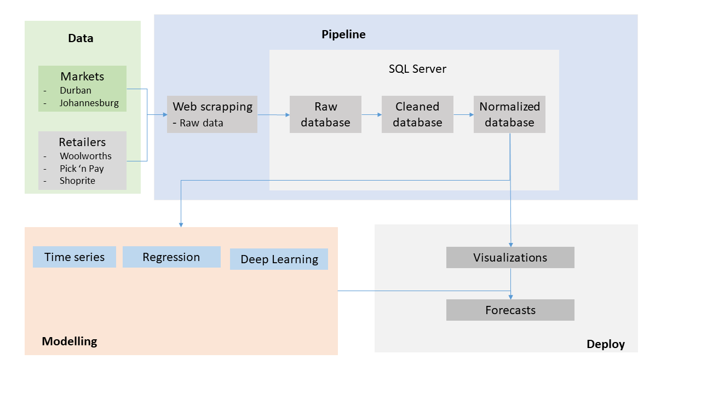

# Inventory Management

## 1. Introduction - A Freshgram analytical approach

This project focuses on inventory management for fresh produce products.

## 2. Analytical Framework
The section dives into the analytical framework that was carried through in order to generate the Freshgram web application. The figure below displays an overview of every component of the framework and how they are inter-connected.

### Solutions Approach
- **Data:** The data is acquired from the respective website for the market of the region and the retailer. The Market and Retail data is updated on a daily and weekly basis respectively.

######

- **Pipeline:** The initial phase of the pipeline involved *Web scrapping*, whereby raw data was extracted from the respective websites using Selenium. The information relayed by the Market data included but not limited to Total Sales, Total Quantity Sold, Average Price Per Kilogram, and Total Quantity Remaining. These information was extracted as is online and stored in a database under the *Raw database*. By applying data wrangling techniques, the raw data is converted to a data format that is appropriate for analysis and then stored in the *Cleaned database*. Finally, in order to reduce or eliminate data redundancy, the data is normalized and stored in a *Normalized database*.

######

- **Modelling:** Various models were created for predicting average prices per kilograms for fresh produce products using *Time Series*, *Regression*, and *Deep Learning* models.  

######

- **Deploy:** A PowerBI dashboard is used for visualizations, these dashboards are embedded onto a Streamlit web application, generating forecasts and inventory optimization analysis.
