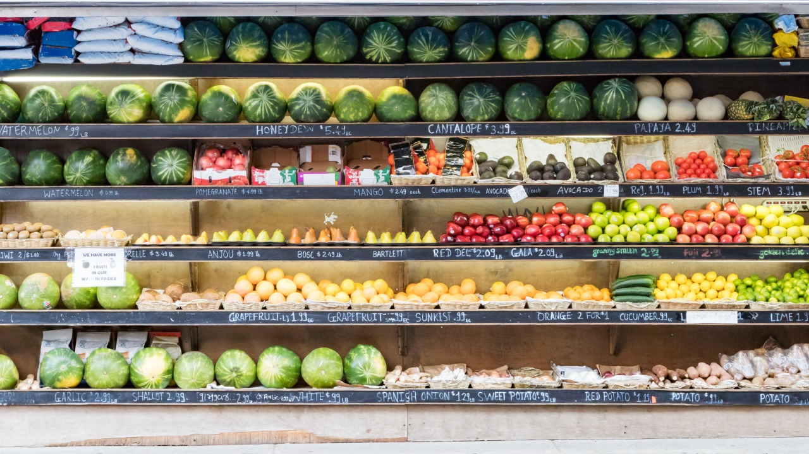
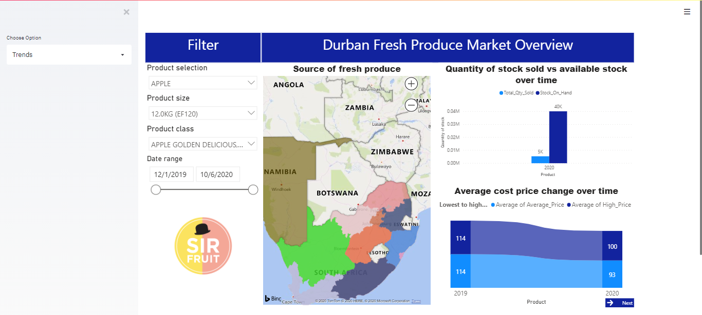
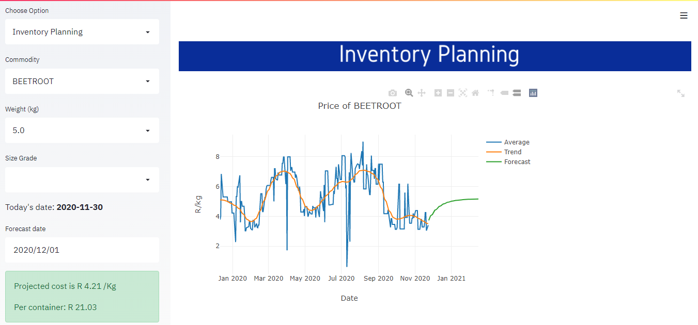
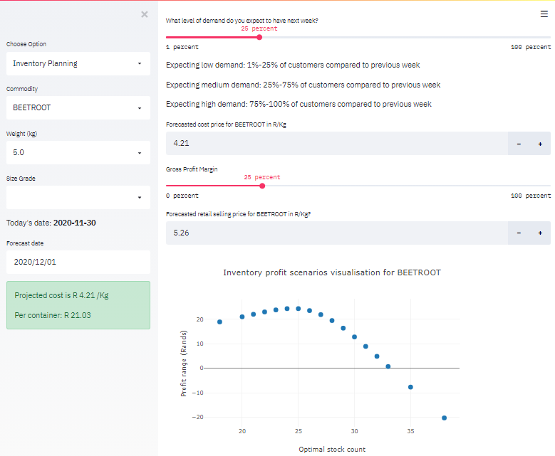

# Inventory Management

## 1. Introduction - A Freshgram analytical approach
The web application can be viewed online [here](https://freshgram.herokuapp.com/)
Inventory management is one of the central problems in retail. Frequently inventory managers need to decide how many items of each product they need to order from suppliers. A manual ordering of products cannot scale to thousands of products and cannot take into account changing demands and many business constraints and costs. Existing inventory optimization systems are not scalable enough to meet the requirements of large retailers. Also, these systems are not flexible enough and cannot incorporate important business goals and constraints.

<p align="center">

</p>

Data scientists and developers will tailor this solution to business goals and constraints of big retailers and will build custom large-scale inventory optimization systems on top of it. These systems will speed up the ordering process and will improve widely used inventory management business metrics (e.g. normalized revenue per day and inventory turnover).

This project focuses on inventory management for fresh produce products.

## 2. Analytical Framework
The section dives into the analytical framework that was carried through in order to generate the Freshgram web application. The figure below displays an overview of every component of the framework and how they are inter-connected.


### Solutions Approach
- **Data:** The data is acquired from the respective website for the market of the region and the retailer. The Market and Retail data is updated on a daily and weekly basis respectively.

######

- **Pipeline:** The initial phase of the pipeline involved *Web scrapping*, whereby raw data was extracted from the respective websites using Selenium. The information relayed by the Market data included but not limited to Total Sales, Total Quantity Sold, Average Price Per Kilogram, and Total Quantity Remaining. These information was extracted as is online and stored in a database under the *Raw database*. By applying data wrangling techniques, the raw data is converted to a data format that is appropriate for analysis and then stored in the *Cleaned database*. Finally, in order to reduce or eliminate data redundancy, the data is normalized and stored in a *Normalized database*.

######

- **Modelling:** Various models were created for predicting average prices per kilograms for fresh produce products using *Time Series*, *Regression*, and *Deep Learning* models.  

######

- **Deploy:** A PowerBI dashboard is used for visualizations, these dashboards are embedded onto a Streamlit web application, generating forecasts and inventory optimization analysis.

## 3. Freshgram web application
The web application has two options, below is the snap shot of the **trend** option which makes use of PowerBI dashboards for visualizations.



The information relayed on the dashboards include, based on the product of interest over a specified period, the change in average pricing as well as pricing range, quantity sold, and quantity remaining in inventory.





## 4. Getting Started
This section is a step-by-step guide on how to launch the Freshgram web application on your local machine. This assumes an Anaconda environment is already installed on your local machine.
```
git clone https://github.com/scmosoeu/fresh_produce.git
```
Access the repo on your Anaconda terminal
```
cd fresh_produce
```
Once inside the repo, run the following command on your terminal to install the virtual environment as well as the supporting packages.
```
conda env create -f environment.yaml
```
Activate the environment
```
conda activate fresh_produce
```
Once the virtual environment has been activated the web application is ready to be launched.
```
streamlit run Inventory-Data-Streamlit-App-master/Inventory_Planner_Demo.py
```
or
```
cd Inventory-Data-Streamlit-App-master
streamlit run Inventory_Planner_Demo.py
```
